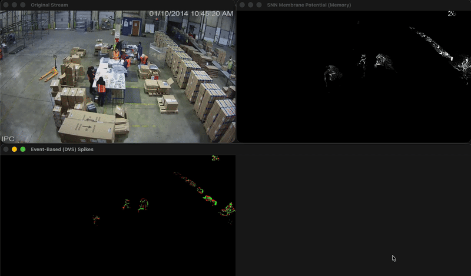

# EventVision-SNN

A project that makes a normal webcam behave like a **Dynamic Vision Sensor (DVS)** — a type of smart camera used in robotics and neuromorphic computing.

Instead of capturing full frames at a fixed frame rate (like a regular camera), a DVS only records **which pixels changed** and **in which direction** (brighter or darker). This makes it much faster and more data-efficient.



---

## What Does This Project Do?

1. **Reads frames** from your webcam (or a video file)
2. **Detects pixel changes** between frames — if a pixel got brighter, it fires an **ON event**; if it got darker, it fires an **OFF event**
3. **Passes those events** through a Convolutional Spiking Neural Network — first a Conv2D layer finds edges and shapes, then LIF neurons decide if they're strong enough to "fire"
4. **Shows you** three live windows: the original feed, the detected events, and the 8 feature maps from the convolutional layer

---

## Core Ideas

**Threshold** — A sensitivity knob. Only changes bigger than this value trigger an event. Lower = more sensitive but noisier.

**ON / OFF Events** — Think of them as pixels raising their hand when something moves. Green = got brighter, Red = got darker.

**Leaky Integrate-and-Fire (LIF) Neuron** — Each pixel has a "charge bucket" that fills up when events arrive and slowly drains over time. When it overflows, the neuron "fires". It's the simplest model of a biological neuron.

---

## SNN Architecture — V1 Cortex Model

The network is inspired by the **V1 visual cortex** — the first layer of the brain that processes raw visual input into edges and shapes.

```
Input Spikes [B, 2, H, W]        ← 2 channels: ON and OFF
    │
    ▼
Conv2D  (8 kernels, 3×3)         ← 8 different edge detectors scanning the spike map
    │                               (learns horizontal lines, vertical lines, diagonals, etc.)
    ▼
LIF Neurons  (one per feature pixel) ← fires when a detected edge is strong enough
    │
    ▼
Output Feature Maps [B, 8, H, W] ← 8 maps showing WHERE each type of edge is active
```

**Why this matters:** The old version just tracked per-pixel brightness changes. The new Conv-SNN can recognise *shapes* — it understands that several spiking pixels together form a line or a corner, not just isolated noise.

---

## Project Structure

```
EventVision-SNN/
├── src/
│   ├── generator.py   # Converts webcam frames into ON/OFF spike maps
│   ├── processor.py   # Conv2D + LIF layer — detects edges and fires feature spikes
│   ├── utils.py       # Helpers: spike visualization & feature map tiling
│   └── main.py        # Entry point — ties everything together
├── tests/
│   └── test_pipeline.py  # Automated tests (no camera needed)
├── data/              # Put video files here (ignored by git)
└── requirements.txt
```

---

## Setup

```bash
# Clone the repo and create a virtual environment
python -m venv .venv
source .venv/bin/activate      # On Windows: .venv\Scripts\activate

# Install dependencies
pip install -r requirements.txt
```

---

## Run

```bash
# Activate your virtual environment first, then:
python src/main.py
# or with a video file:
python src/main.py --source data/test_vid1.mp4
```

Three windows will open:
- **Original Stream** — your webcam feed or video file
- **Event-Based (DVS) Spikes** — green pixels = brightness increased, red = decreased
- **SNN Feature Maps (8 Edge Detectors)** — a 2×4 tiled grid showing each of the 8 conv kernels responding to motion in the scene

Press **`q`** to quit.

---

## Run Tests

```bash
python -m pytest tests/ -v
```